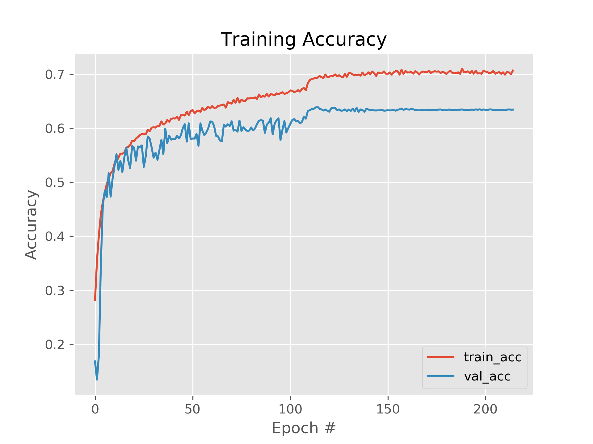

# Real Time Emotion Analysis Using Facial Expressions

In this project, developed a client-server application that try to recognize human emotions by using facial expressions.

## Requirements

- Node.js
- Anaconda
- Graphics Card (Nvidia GPU with min 2GB VRAM)

## Architecture


As seen in the diagram, we build a RESTful web service using Flask framework that tries to recognizte emotions on the server-side and a ReacJS web application that captures frames from video or webcam feed and show results on display as charts and images on the client-side.

What this web service does is, first it's tries to detect faces(using OpenCV's `dnn` module) from captured frames(encoded with Base64) that coming from web app, and then a simple object tracking algorithm label these faces and add them to a dictionary. After that our trained FER model tries to recognize emotions from the labeled faces and send results to the web app.

## Overeview of the FER Model

Developed FER(Facial Expression Recognition) model for emotion recognition is called [MiniXception](https://github.com/oarriaga/face_classification/blob/master/report.pdf) model. This model is trained with [FER-2013](https://www.kaggle.com/c/challenges-in-representation-learning-facial-expression-recognition-challenge/data) dataset.

The trained model have ~65% accuracy.


## Get Started

To run the project there are several things to do.

### Anaconda Environment Setup

To create conda environment for web service run the following command:

```
$ conda env create -f requirements.yml
```

After that activate the environment:

```
$ conda activate tf_gpu
```

### Database Setup

To create SQLite database run the following command:

```
$ cd web_service/database
$ sqlite3 fer_db.db < session_results.sql
```
This database purpose is in the web app you can save session data if you want.

### Train FER Model (Optional)

If you want to train the model, first you have to download FER-2013 dataset to `dataset` folder under root directory and then you can run the following command to start training:

```
$ python train_fer2013.py
```

### Install NPM Dependencies

To run web app you have to install the web depencies. For this go `web_app` folder and run `npm install` command.

### Run Web Service and Web Application Using VSCode

If you are using VSCode you can simply run web service and web application. Open project with VSCode and go to "Terminal > Run Task..." and select "Start Gunicorn". After that again go "Terminal > Run Task..." and select "npm: start: web_app/"

### Run Web Service (without VSCode)

You can run the following command under the root directory to start web service:

```
$ ./scripts/gunicorn_start.sh
```

### Run Web Application (without VSCode)

As the same you can run the following command under the root directory to start web app:

```
$ cd web_app && npm start
```
